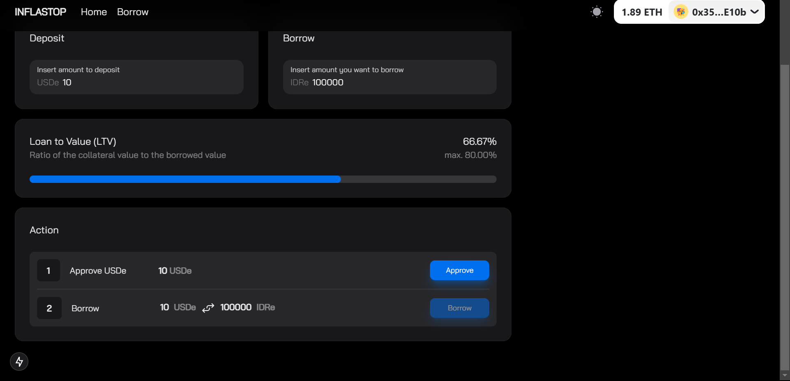

# **InflaStop**

InflaStop is a decentralized, anti-inflation stablecoin platform built on USDe backing. It offers interest-free loans, yield-based funding, and a transparent ecosystem for users to manage and grow their financial assets effectively.

---

## **Our Mission**

To empower individuals with a stable financial system that combats inflation, eliminates interest burdens, and maximizes yield for sustainable economic growth.

---

## **Table of Contents**

1. [Problems](#problems)
2. [Why Choose InflaStop](#why-choose-inflastop)
3. [Key Features](#key-features)
4. [How It Works](#how-it-works)
5. [Roadmap and Challenges](#roadmap-and-challenges)
6. [Demo](#demo)
7. [Screenshots](#screenshots)
8. [Technical Details](#technical-details)

---

## 🚧 **Problems**

Traditional financial systems are often plagued by:

- **Inflationary Erosion**: The value of assets decreases over time due to inflation.
- **High-Interest Loans**: Borrowers face significant financial burdens from interest payments.
- **Inefficient Yield Allocation**: Investment profits often favor institutions over individuals.
- **Lack of Transparency**: Limited visibility into fund management and operations.

---

## 💡 **Why Choose InflaStop**

InflaStop addresses these challenges by offering:

- **Inflation Protection**: A USDe-backed stablecoin ensures stability and security.
- **No-Interest Loans**: Borrow without interest and repay seamlessly from yield.
- **Fair Yield Distribution**:
  - 80% of the yield is returned to users.
  - 20% is used for platform operational costs.
- **Transparent Operations**: Real-time dashboards and decentralized governance ensure trust and accountability.

---

## 🏆 **Key Features**

1. **Stablecoin Backed by USDe**: A reliable and inflation-proof digital asset.
2. **Interest-Free Loans**: Easy borrowing without additional financial stress.
3. **Yield-Based Ecosystem**:
   - Borrow repayments are funded through generated yield.
   - Fair distribution ensures user-centric benefits.
4. **User-Centric Governance**: Transparent and decentralized decision-making.
5. **Claimable Yield**: Users can easily claim their yield through the platform.

---

## 🔧 **How It Works**

### **Staking by Users**

Users deposit stablecoins (backed by USDe) on the InflaStop platform. The funds are invested to generate sustainable yield.

### **Yield Distribution**

The yield generated is distributed proportionally:

- **80% to Users**: Returns to borrowers and stakers.
- **20% to Platform**: Covers operational costs.

### **Interest-Free Loans**

Users can borrow stablecoins without interest. Repayment is deducted automatically from generated yield.

### **Real-Time Governance and Transparency**

Users can monitor transactions, yield generation, and fund utilization via an on-chain governance dashboard.

---

## 🛣️ **Roadmap and Challenges**

### **Roadmap**

#### Phase 1: Platform Launch

- Launch core functionalities: staking, yield distribution, and loan modules.
- Deploy governance dashboard for transparency.

#### Phase 2: Community Growth

- Expand user base with targeted campaigns.
- Onboard early adopters and establish partnerships.

#### Phase 3: Global Expansion

- Introduce multi-currency support.
- Scale to accommodate cross-border users and projects.

### **Challenges**

- **Adoption**: Educating users about decentralized finance.
- **Regulations**: Complying with global KYC/AML standards.
- **Security**: Ensuring smart contract robustness.
- **Sustainability**: Balancing yield generation with operational efficiency.

---

## 🎥 **Demo**

Watch the InflaStop platform in action: [Demo Video](https://drive.google.com/file/d/1tsmZY7Ps8stLbyNuE_xDKpE89lKz5hj8/view?usp=sharing)

---

## 📸 **Screenshots**

| **Feature** | **Preview**                    |
| ----------- | ------------------------------ |
| **Deposit** |  |
| **Borrow**  |    |
| **Home**    |        |

---

## 🛠️ **Technical Details**

- Frontend: React, Next.js, TypeScript, Tailwind CSS, Wagmi, Viem, @rainbow-me/rainbowkit
- UI Components: @nextui-org/react, @headlessui/react, @heroicons/react
- Smart Contract Integration: USDe, sUSDe
- Virtual TestNets: Tenderly
- [Smart Contract Reepository](https://github.com/PugarHuda/antiInflasi)

---
